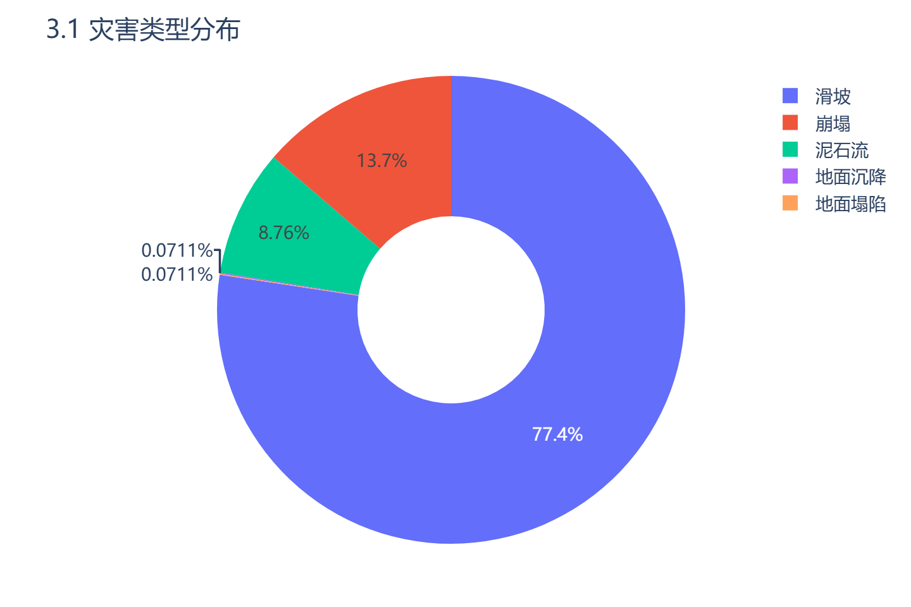
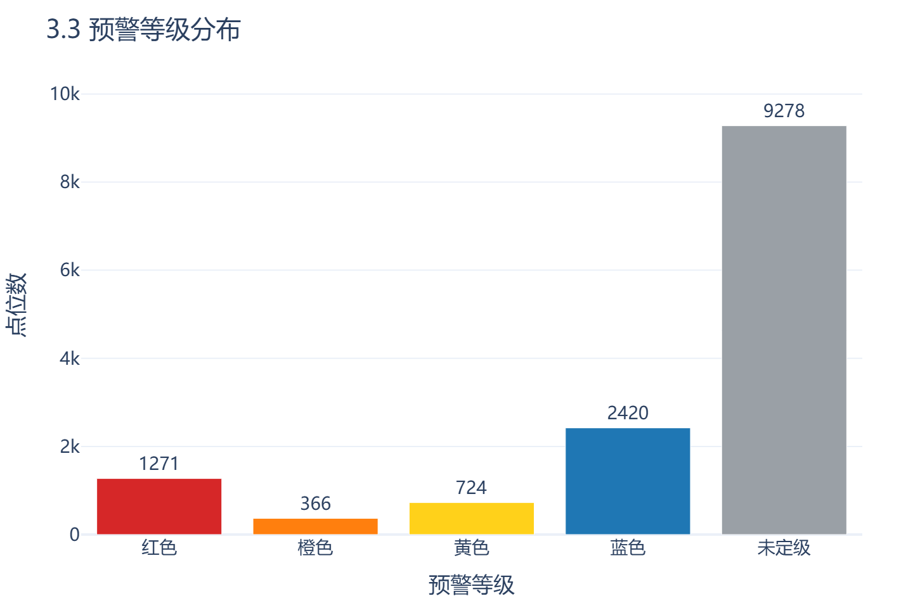
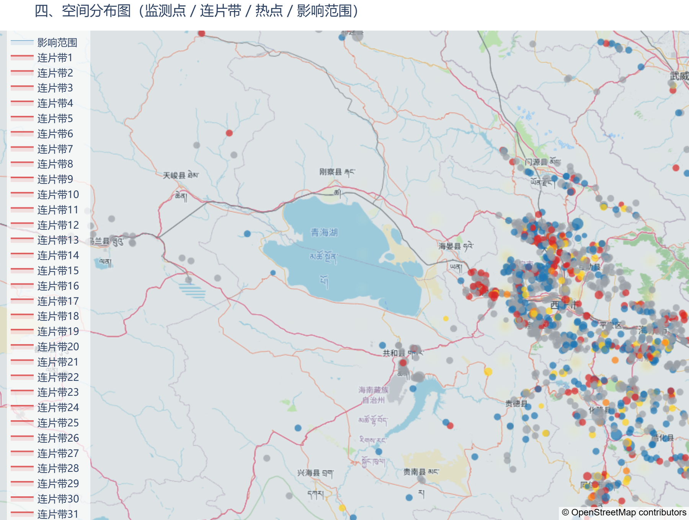

# 灾圈地质灾害风险分析报告

**报告编号**：6a5c003f1b44　　**生成时间**：2026-06-08 16:43:09
**灾圈范围**：201 顶点多边形,外接经度 [89.5067, 110.9522]　　**灾圈面积**：1720197.31 km²
**圈内有效监测点**：14059 个（已剔除已核销点）

---

## 一、概述

本报告针对 201 顶点多边形,外接经度 [89.5067, 110.9522] 所圈定范围，对圈内 14059 个有效地质灾害监测点的记录信息进行汇总与综合研判。截至 2026-06-08 16:43:09，圈内灾害类型构成为 滑坡 10881、崩塌 1926、泥石流 1232、地面沉降 10、地面塌陷 10；规模等级构成为 小 2907、中 1096、大 232、特大 7、未分级 9817；预警等级构成为 红色 1271、橙色 366、黄色 724、蓝色 2420、未定级 9278。

> 数据来源：`dwd_gh_v1.dwd_monitor_point_info_view`。本次分析未接入数字高程模型(DEM)，地形相关内容均基于监测点填报值，详见第八章。

---

## 二、监测点清单

圈内有效监测点共 14059 个，重点关注点位已标注（详见第六章）。

| 序号 | 国家编号 | 名称 | 所在行政区 | 灾害类型 | 规模 | 预警等级 | 威胁人数 | 威胁财产(万元) | 重点 |
|---|---|---|---|---|---|---|---|---|---|
| 1 | 623021020037 | 陈旗乡王旗村上磨沟西山崩塌 | 甘肃省 甘南藏族自治州 临潭县 | 崩塌 | 大 | 红色 | 10 | 75.0 | ★ |
| 2 | 623023010102 | 东山乡中牌村滑坡 | 甘肃省 甘南藏族自治州 舟曲县 | 滑坡 | 特大 | 红色 | 1300 | 8000.0 | ★ |
| 3 | 623023010107 | 江盘乡河南村河南滑坡 | 甘肃省 甘南藏族自治州 舟曲县 | 滑坡 | 大 | 橙色 | 420 | 2000.0 | ★ |
| 4 | 623023010125 | 江盘乡端山村滑坡 | 甘肃省 甘南藏族自治州 舟曲县 | 滑坡 | 大 | 红色 | 800 | 3560.0 | ★ |
| 5 | 623023010139 | 憨班乡老沟滑坡 | 甘肃省 甘南藏族自治州 舟曲县 | 滑坡 | 大 | 红色 | 612 | 2000.0 | ★ |
| 6 | 623024020132 | 纳告崩塌 | 甘肃省 甘南藏族自治州 迭部县 | 崩塌 | 大 | 红色 | 5 | 30.0 | ★ |
| 7 | 632122010393 | 青海省海东市民和县民和县前河乡上湾村白崖社滑坡 | 青海省 海东市 民和回族土族自治县 | 滑坡 | 大 | 红色 | 22 | 35.3 | ★ |
| 8 | 632222020010 | 扎麻什乡多什多新村崩塌 | 青海省 海北藏族自治州 祁连县 | 崩塌 | 大 | 红色 | 148 | 240.0 | ★ |
| 9 | __610727010572 | 老坟坑滑坡 | 陕西省 汉中市 略阳县 | 滑坡 | 特大 | 红色 | 9 | 152.4 | ★ |
| 10 | __630222010027 | 青海省海东市民和县官亭镇赵木川村安家社滑坡 | 青海省 海东市 民和回族土族自治县 | 滑坡 | 大 | 红色 | 82 | 132.0 | ★ |
| 11 | __640202010004 | 汝箕沟303省道滑坡 | 宁夏回族自治区 石嘴山市 大武口区 | 滑坡 | 大 | 红色 | 0 | 100.0 | ★ |
| 12 | 610122010022 | 上陈村滑坡 | 陕西省 西安市 蓝田县 | 滑坡 | 大 | 红色 | 69 | 520.0 | ★ |
| 13 | 610122020022 | 黑沟村崩塌 | 陕西省 西安市 蓝田县 | 崩塌 | 大 | 红色 | 105 | 1000.0 | ★ |
| 14 | 610202020002 | 新兴社区新兴沟崩塌群 | 陕西省 铜川市 王益区 | 崩塌 | 大 | 橙色 | 122 | 1000.0 | ★ |
| 15 | 610303010011 | 电线厂滑坡 | 陕西省 宝鸡市 金台区 | 滑坡 | 大 | 橙色 | 4 | 120.0 | ★ |
| 16 | 610326020002 | 魏家堡崩塌 | 陕西省 宝鸡市 眉县 | 崩塌 | 大 | 红色 | 122 | 276.0 | ★ |
| 17 | 610327010027 | 寺咀滑坡 | 陕西省 宝鸡市 陇县 | 滑坡 | 大 | 红色 | 8 | 30.0 | ★ |
| 18 | 610624010032 | 陈家洼1号滑坡 | 陕西省 延安市 安塞区 | 滑坡 | 大 | 红色 | 14 | 42.6 | ★ |
| 19 | 610924030014 | 荷叶沟泥石流 | 陕西省 安康市 紫阳县 | 泥石流 | 大 | 红色 | 8 | 150.0 | ★ |
| 20 | 610925010041 | 学校院子滑坡 | 陕西省 安康市 岚皋县 | 滑坡 | 大 | 红色 | 49 | 800.0 | ★ |
| 21 | 610928010182 | 槐树凹滑坡 | 陕西省 安康市 | 滑坡 | 大 | 红色 | 12 | 75.0 | ★ |
| 22 | 621202011834 | 土门垭村2号滑坡 | 甘肃省 陇南市 武都区 | 滑坡 | 大 | 红色 | 160 | 300.0 | ★ |
| 23 | 621202011882 | 李家咀滑坡 | 甘肃省 陇南市 武都区 | 滑坡 | 大 | 红色 | 450 | 1200.0 | ★ |
| 24 | 621222010434 | 中庙镇后渠村滑坡 | 甘肃省 陇南市 文县 | 滑坡 | 大 | 红色 | 97 | 500.0 | ★ |
| 25 | 621222010442 | 中庙镇姚坪村南侧滑坡 | 甘肃省 陇南市 文县 | 滑坡 | 大 | 红色 | 340 | 1800.0 | ★ |
| 26 | 621222010626 | 后渠村郭家坝滑坡 | 甘肃省 陇南市 文县 | 滑坡 | 大 | 红色 | 102 | 500.0 | ★ |
| 27 | 621222010627 | 强坝村谢家坪滑坡 | 甘肃省 陇南市 文县 | 滑坡 | 大 | 红色 | 150 | 700.0 | ★ |
| 28 | 621222010629 | 强曲村滑坡 | 甘肃省 陇南市 文县 | 滑坡 | 大 | 红色 | 100 | 500.0 | ★ |
| 29 | 621222010631 | 石鸡坝村剪子坪2号滑坡 | 甘肃省 陇南市 文县 | 滑坡 | 大 | 红色 | 200 | 980.0 | ★ |
| 30 | 621222010633 | 月亮坝村张家坝滑坡 | 甘肃省 陇南市 文县 | 滑坡 | 大 | 红色 | 140 | 700.0 | ★ |

> 注：圈内共 **14059** 个监测点，清单过长，完整逐字段清单已作为附件：[monitor_points.csv](figures/monitor_points.csv)；上表仅列重点关注点位。

> `监测点清单（见上表）`：代码按圈内点集生成，重点点位列标注「★」。完整逐字段数据见附录。

---

## 三、分类统计

**3.1 灾害类型分布**　滑坡 10881、崩塌 1926、泥石流 1232、地面沉降 10、地面塌陷 10
**3.2 规模等级分布**　小 2907、中 1096、大 232、特大 7、未分级 9817
**3.3 预警等级分布**　红色 1271、橙色 366、黄色 724、蓝色 2420、未定级 9278
**3.4 隐患识别情况**　0 个(占 0.0%)

**3.5 威胁要素汇总**

| 指标 | 合计 |
|---|---|
| 威胁人数 | 1268357 人 |
| 威胁户数 | 70666 户 |
| 威胁财产 | 6565657.86 万元 |

> 图表占位：、（代码生成）。

---

## 四、空间格局分析

**4.1 连片隐患带**　识别出 371 个连片带(DBSCAN,eps=500m,min_samples=3),涉及 1636 个点位;带61(34点):[__620102001, __620102010068, __620102010095, __620102010108, __620102010137, __620102010218, __620102010279, __620102010284, __620102010336, __620102010345, __620102010354, __620102010368, __62010201047301, __620102010489, __620102010490, __620102010539, __620102010541, 620102000579, 620102000593, 620102000597, 620102000599, 620102000693, 620102000694, 620102000696, 620102000698…等34个];带67(30点):[__620102010070, __620102010071, __620102010092, __620102010113, __620102010114, __620102010157, __620102010205, __620102010234, __620102010245, __620102010249, __620102010320, __62010201033301, __620102010355, __620102010404, __620102010433, __620102010506, __620102010549, __620102010550, __620102010552, __620102020017, __62010202002001, __620102020027, __620102020034, __620102020041, 620102000548…等30个];带64(27点):[__620102010040, __620102010052, __620102010053, __620102010093, __620102010118, __620102010129, __620102010172, __620102010263, __620102010299, __620102010389, __620102010403, __620102010459, __620102010481, __620102010491, __620102010492, __620102010526, __620102010558, __620102010568, 620102000512, 620102000513, 620102000519, 620102000586, 620102000652, 620102000973, 620102000979…等27个];带76(21点):[__62010301000901, __620103010082, __620103010084, __620103010089, __620103010092, __620103010174, __620103010182, __620103010189, __620103020046, __620103020047, 620103000189, 620103000216, 620103000217, 620103000278, 620103010097, 620103010100, 620103010102, 620103010105, 620103010107, 620103010108, 620103020056];带71(20点):[__62010201022101, __62010201046201, __620103020036, __620103020037, 620102000867, 620102000868, 620102000870, 620102000943, 620102000944, 620102000946, 620102000947, 620102000948, 620102000964, 620102000965, 620102000967, 620102000970, 620103000192, 620103000193, 620103000195, 620103000255];带369(20点):[513225010061, 513225030104, 513225030105, 513225030106, 513225030107, 513225030108, 513225030109, 513225030110, 513225030111, 513225030112, 513225030116, 513225030117, 513225030118, 513225030119, 513225030120, 513225030121, 513225030123, 513225030126, 513225030127, 513225030196];带62(18点):[__620102010037, __620102010038, __620102010042, __620102010060, __620102010087, __620102010196, __620102010207, __620102010276, __620102010294, __620102010317, __620102010385, __620102010411, __620102010444, __620102010512, __620102010555, 620102000493, 620102000647, 620102010045];带115(18点):[__620105010027, __620105010029, __620105010034, __620105010039, __620105010044, __620105010091, __620105010101, __620105010104, 620105000120, 620105000121, 620105000122, 620105000125, 620105000128, 620105000129, 620105000133, 620105000134, 620105000157, 620105030024];其余 363 个连片带从略

> 完整连片带-成员明细(共 371 个带)已作为附件：[clusters.csv](figures/clusters.csv)。
**4.2 风险热点区**　核密度高值区位于 (103.892332, 36.015666) 附近,邻近点位:[620102010064, 620102030065, 620102010065]
**4.3 影响范围**　圈内点集影响范围约 1415636.06 km²(alpha-shape近似)

> 空间分布图占位：（分析用 sklearn/scipy/shapely 计算几何，**Plotly 渲染** + OSM 底图，标注监测点、连片带、热点、灾圈边界）。

---

## 五、综合风险研判

**5.1 区域整体风险**
风险等级：**高**
研判依据：圈内滑坡占比77.4%（10881/14059），红色预警1271个（占9%），橙色366个，连片隐患带371个涉及1636个点位，风险热点区位于(103.892332,36.015666)附近，威胁总人数约126.8万，财产约656.6亿元，空间聚集显著。

**5.2 主导灾害类型与成因**
主导灾害类型：滑坡
成因分析：滑坡数量10881，占灾害类型77.4%。主要诱发因素为降雨（9922次）和地震（5683次），人为因素也较突出（4553次）。受地形影响：坡度信息缺失，但基于填报值（未经地形数据校验），推断坡体稳定性受降雨和地震活动控制。岩性无填报，需现场复核。
基于填报值，未经地形数据校验

**5.3 共性诱发因素**
- 降雨
- 地震
- 人为因素
- 切坡　（逐项列出）

**5.4 发展趋势研判**
总体判断：当前处于高威胁状态，多数点位未填报现状趋势，但红色预警和大型以上灾害点集中，且连片带内点位密集，若遇强降雨或地震，可能发生群发性灾害，整体风险趋升。
依据点位：621222010627、621222010629、621222010631、621222010633、623023010139、610122010022

> 本章为专家研判性结论，区别于第二、三、四章的客观统计。

---

## 六、重点关注点位

下列点位需重点关注，逐点说明关注原因与针对性建议（编号已经渲染层溯源校验）：

| 国家编号 | 关注原因 | 针对性建议 |
|---|---|---|
| 623023010102 | 特大规模滑坡，红色预警，威胁人数1300人，财产8000万元，位于连片带（未明确带号但属高威胁），诱发因素包括地震和降雨。 | 立即启动应急预案，组织受威胁群众撤离避险；加密自动监测频次至每小时1次；现场核查坡体裂缝及变形，必要时实施工程治理。 |
| 610202020002 | 大型崩塌群，橙色预警，威胁122人，财产1000万元，诱发因素含地震、降雨及人为因素，位于连片带（未明确但属高关注）。 | 近期开展应急巡查，布设简易裂缝监测；限制坡脚人为活动；考虑搬迁避让或被动防护网。 |
| 610122010022 | 大型滑坡，红色预警，威胁69人，财产520万元，位于人口密集区，诱发因素含降雨和人为因素。 | 紧急撤离受威胁群众；削方减载与排水工程；设置警示标识，纳入群测群防。 |
| 621222010627 | 大型滑坡，红色预警，威胁150人，财产700万元，位于连片带（带61或附近），降雨诱发，属汉源县高风险区。 | 紧急避险，加强巡查；安装裂缝计监测；结合降雨预报提前预警。 |
| 610327010027 | 大型滑坡，红色预警，威胁8人，财产30万元，但位于风险热点区附近，降雨诱发，规模为大型。 | 加强日常巡查；降雨期加密监测；对坡体进行简易排水。 |

---

## 七、分级处置建议

**7.1 紧急（立即处置）**
- 对红色预警且威胁人数超过100的灾害点（如623023010102、621222010627等）立即组织撤离，24小时不间断监测。
- 对连片带内大型以上灾害点（如带61、带67）启动应急排查，安装GNSS和裂缝计。
- 向风险热点区（103.892332,36.015666）周边乡镇发布红色预警信号。

**7.2 近期（限期落实）**
- 对橙色预警和黄色预警点进行逐点核查，评估稳定性。
- 在降雨集中期（6-9月）加密蓝色预警点的巡查频次。
- 补全缺失的岩性、坡度、现状趋势等关键字段，开展详细调查。

**7.3 常态（持续监测巡查）**
- 对蓝色及未定级点位纳入群测群防体系，按年度巡查。
- 修复和完善监测设备，确保数据传输正常。
- 加强地质灾害防治宣传培训，提升群众识灾避灾能力。

---

## 八、数据局限说明

- 未接入数字高程模型(DEM)，地形分析仅基于监测点填报值（坡度多数缺失），未经地形数据校验。
- 岩性字段全部缺失，无法判断地层岩性与岩土体类型。
- 绝大多数点位（9278个）未定预警等级，现状与趋势描述无填报，研判依据不足。
- 隐患识别占比为0%，说明当前未开展隐患动态识别。
- 部分重点点位（如610624010032）诱发因素缺失，需现场复核。　（逐项列出）

固定补充：

- 本次分析**未接入数字高程模型(DEM)**：空间分析（连片/热点/影响范围/属性统计）不受影响、照常准确；涉及坡度、坡向、汇水、沟道的内容**均来自填报值，未经地形数据校验**，相关研判结论须结合现场复核使用。
- 字段缺失情况：威胁人数缺失 1566 条、威胁户数缺失 417 条、威胁财产缺失 1446 条、坡度缺失 14059 条；重点点位明细仅列前 30 个高风险点(按优先级截断)（代码侧缺失计数，如威胁人数缺失 N 条、坡度异常 M 条）。
- 后续可接入公开 DEM（SRTM 30m / ALOS 12.5m，建议 ≤10m）补充地形计算与填报值校验，提升研判客观性。

---

## 附录　监测点完整数据表

完整逐字段监测点数据表(共 14059 行)较长，已作为附件提供：[monitor_points.csv](figures/monitor_points.csv)。

> 代码按圈内点集输出全字段表，供核查溯源。